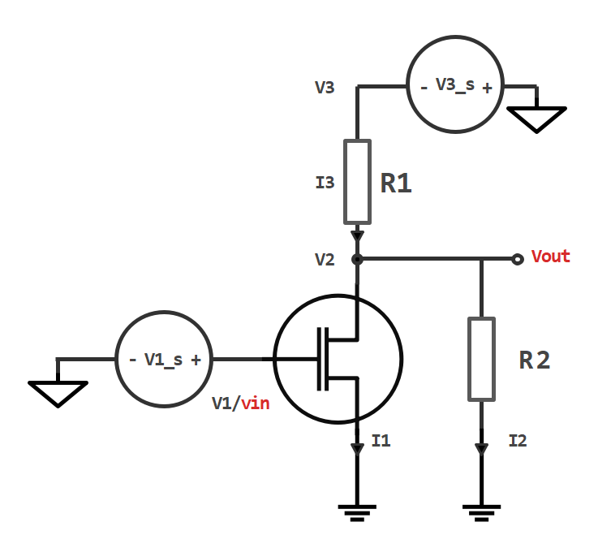

# NMOS共源放大器仿真

## 1.NMOS共源放大器电路图

	

	
	 
	图1：NMOS共源放大器
	

## 2.电路变量与电路矩阵方程

变量：
$$
V_{1},V_{2},V_{3},I_{1},I_{2},I_{3}
$$
方程：
$$
V_{1}=V_{1s}\\
V_{3}=V_{3s}\\
V_{2}-I_{2}R_{2}=0\\
V_{3}-V_{2}-I_{3}R_{1}=0\\
I_{1}+I_{2}-I_{3}=0\\
I_{1}=\begin{equation}  
\left\{  
             \begin{array}{lr}  
             0,&V_{1}<V_{th}\\
			 \mu_{n}C_{ox}\frac{W}{L}((V_{1}-V_{th})V_{2}-\frac{1}{2}V_{2}^{2}),&V_{1}>V_{th}\text{ and }V_{2}<V_{1}-V_{th}\\
			 \frac{1}{2}\mu_{n}C_{ox}\frac{W}{L}(V_{1}-V_{th})^{2},&V_{1}>V_{th}\text{ and }V_{2}\geq V_{1}-V_{th}
             \end{array}  
\right.
\end{equation}
$$
矩阵方程：
$$
\begin{bmatrix}
0 & 1 & 1 & -1 \\
1 & 0 & -R_{2} & 0 \\
1 & 0 & 0 & R_{1} \\
0 & 1 & 0 & 0
\end{bmatrix}
\begin{bmatrix}
V_{2n}\\
I_{1n}\\
I_{2n}\\
I_{3n}\\
\end{bmatrix}
=
\begin{bmatrix}
0\\
0\\
I_{2n}\\
I_{3n}\\
\end{bmatrix}
$$
