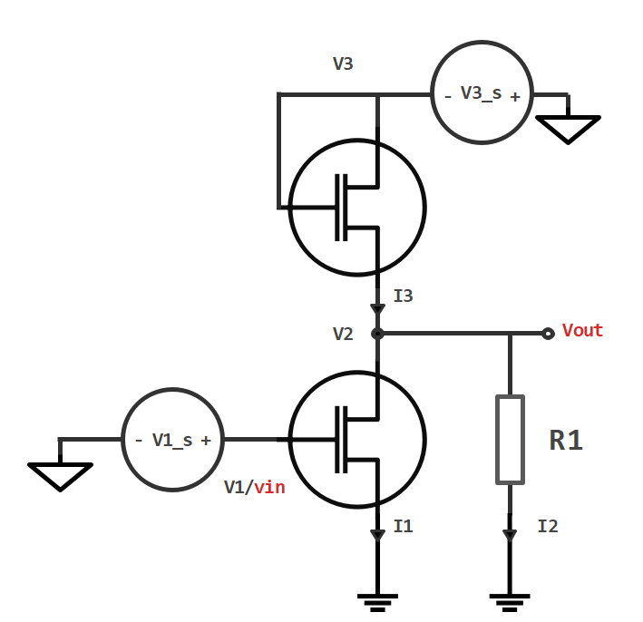
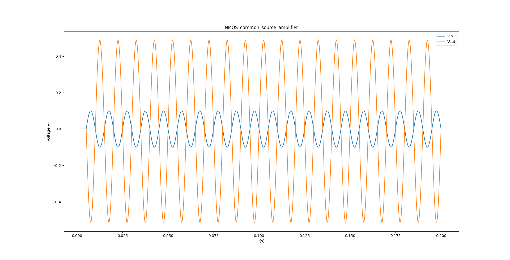

# NMOS—NMOS共源放大器仿真

## 1.步骤(红色部分为知识点)

1.NMOS模型加入NMOS管二级效应-<strong style="color:red;">长度调制效应</strong>。

2.NMOS模型加入NMOS管二级效应-<strong style="color:red;">体效应</strong>。

3.NMOS管作为负载的NMOS共源放大器的仿真。

4.NMOS—NMOS共源放大器小信号仿真放大结果与<strong style="color:red;">小信号理论</strong>比对。

5.NMOS—NMOS共源放大器<strong style="color:red;">器件分析</strong>。

## 2.NMOS-NMOS共源放大器电路图

	

	
	 
	图1：NMOS共源放大器
	

## 3.电路变量与电路矩阵方程

NMOS管长度调制效应:

​		当$V_{DS}>V_{GS}-V_{th}$即NMOS管进入饱和区时

变量：
$$
V_{1},V_{2},V_{3},I_{1},I_{2},I_{3}
$$
方程：
$$
V_{1}=V_{1s}\\
V_{3}=V_{3s}\\
V_{2}-I_{2}R_{2}=0\\
V_{3}-V_{2}-I_{3}R_{1}=0\\
I_{1}+I_{2}-I_{3}=0\\
I_{1}=\begin{equation}  
\left\{  
             \begin{array}{lr}  
             0,&V_{1}<V_{th}\\
			 \mu_{n}C_{ox}\frac{W}{L}((V_{1}-V_{th})V_{2}-\frac{1}{2}V_{2}^{2}),&V_{1}>V_{th}\text{ and }V_{2}<V_{1}-V_{th}\\
			 \frac{1}{2}\mu_{n}C_{ox}\frac{W}{L}(V_{1}-V_{th})^{2},&V_{1}>V_{th}\text{ and }V_{2}\geq V_{1}-V_{th}
             \end{array}  
\right.
\end{equation}
$$
矩阵方程：
$$
\begin{bmatrix}
0 & 1 & 1 & -1 \\
1 & 0 & -R_{2} & 0 \\
1 & 0 & 0 & R_{1} \\
0 & 1 & 0 & 0
\end{bmatrix}
\begin{bmatrix}
V_{2_n}\\
I_{1_n}\\
I_{2_n}\\
I_{3_n}\\
\end{bmatrix}
=
\begin{bmatrix}
0\\
0\\
V_{3s_n}\\
I_{n-1}\\
\end{bmatrix}
$$
其中：
$$
I_{n-1}=\begin{equation}  
\left\{  
             \begin{array}{lr}  
             0,&V_{1_n}<V_{th}\\
			 \mu_{n}C_{ox}\frac{W}{L}((V_{1_n}-V_{th})V_{2_n}-\frac{1}{2}V_{2_n}^{2}),&V_{1_n}>V_{th}\text{ and }V_{2_n}<V_{1_n}-V_{th}\\
			 \frac{1}{2}\mu_{n}C_{ox}\frac{W}{L}(V_{1_n}-V_{th})^{2},&V_{1_n}>V_{th}\text{ and }V_{2_n}\geq V_{1_n}-V_{th}
             \end{array}  
\right.
\end{equation}
$$

## 4.仿真结果和小信号放大结果

	

	
	 
	图2：NMOS共源放大器仿真结果
	

	

	
	 
	图3：NMOS共源放大器小信号放大结果
	

## 5.分析

仿真了理想NMOS的电学特性。
